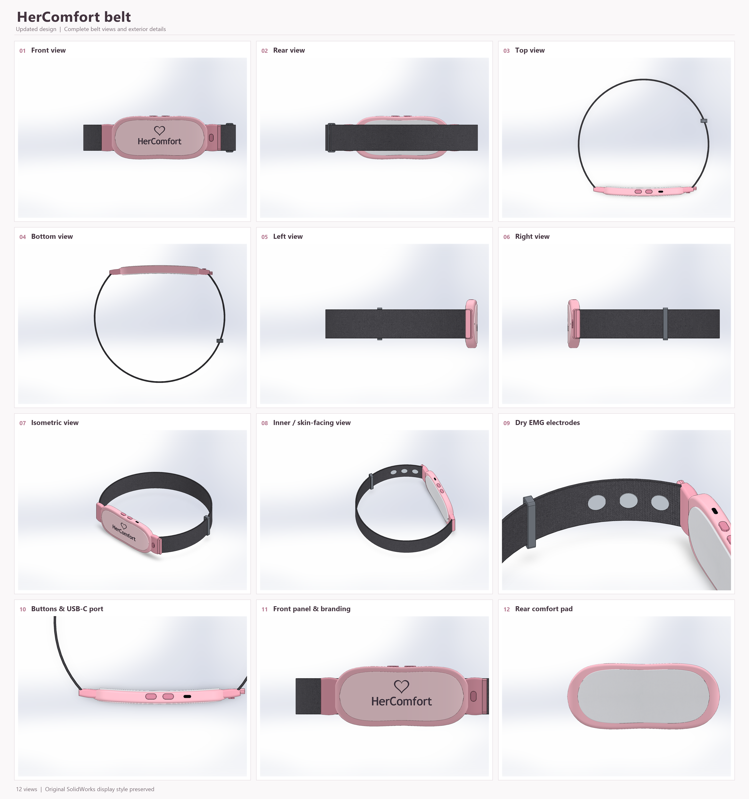
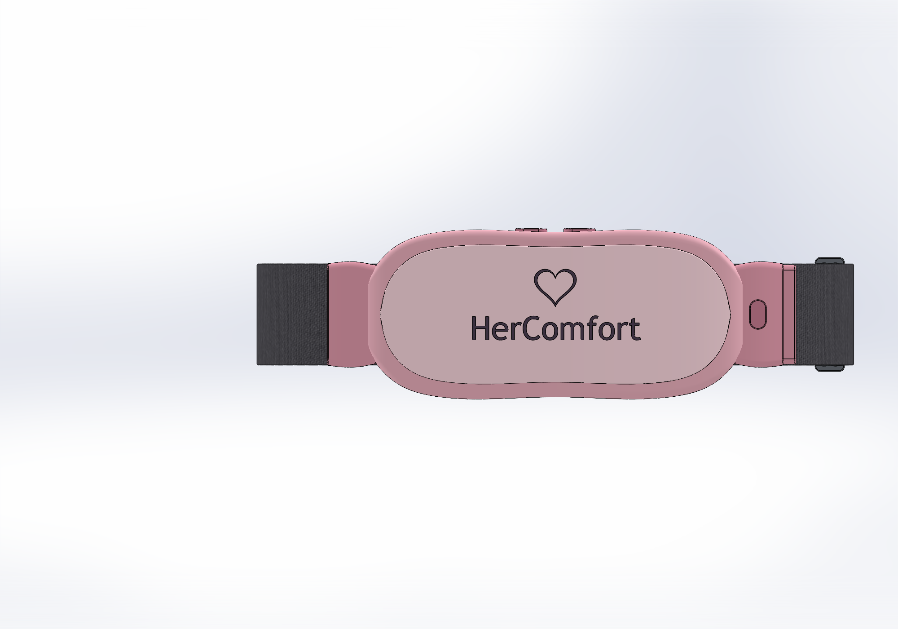
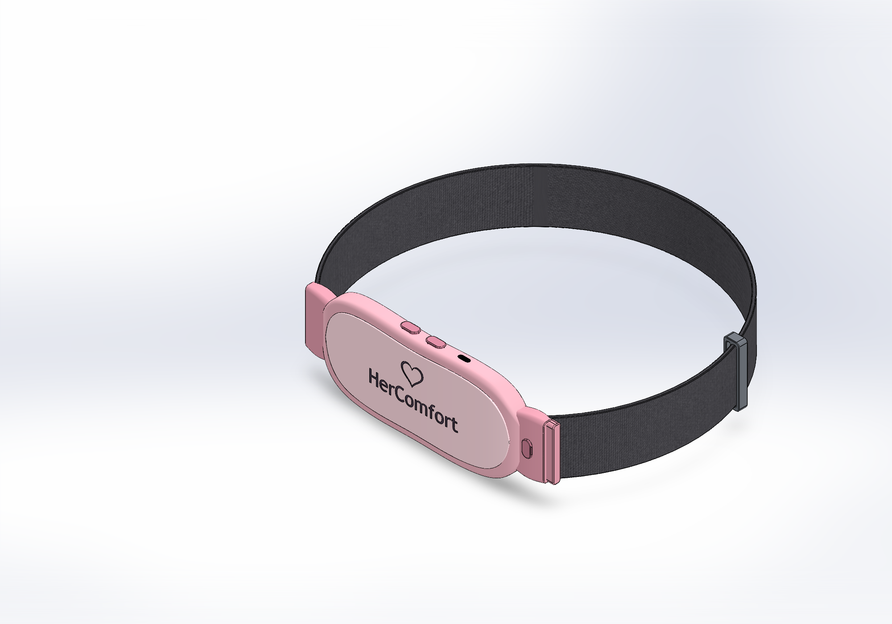
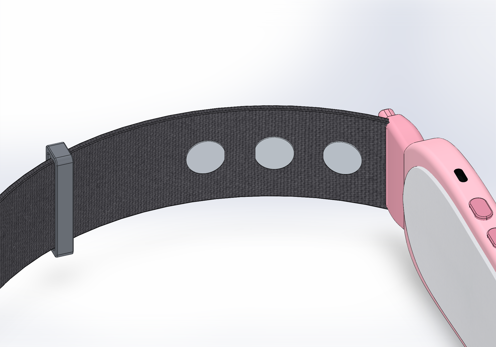
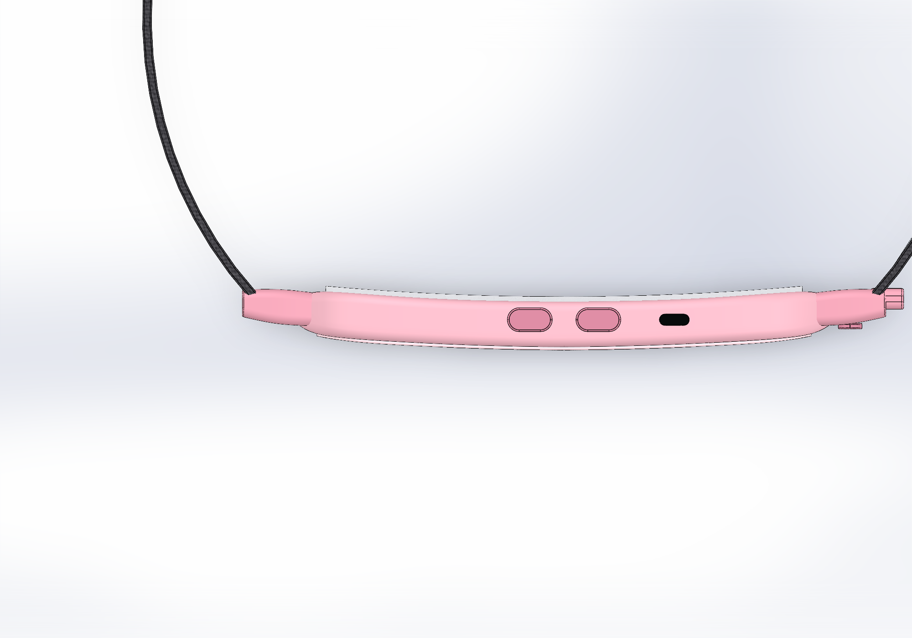
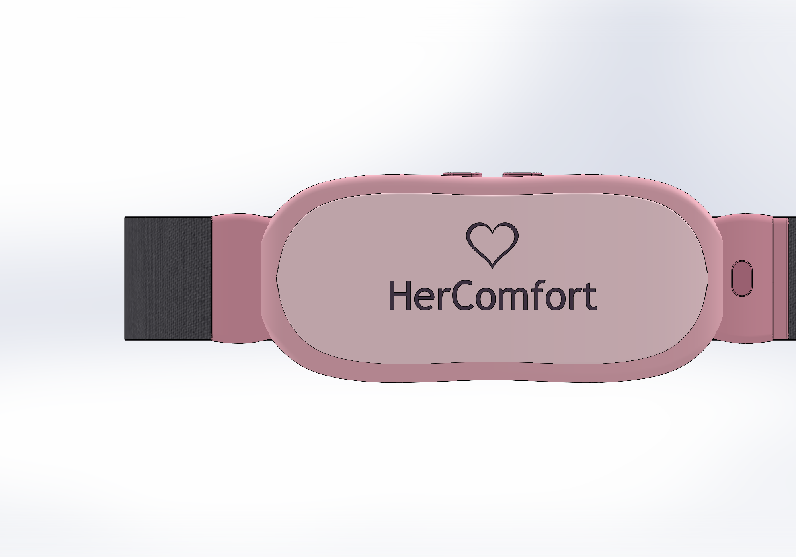
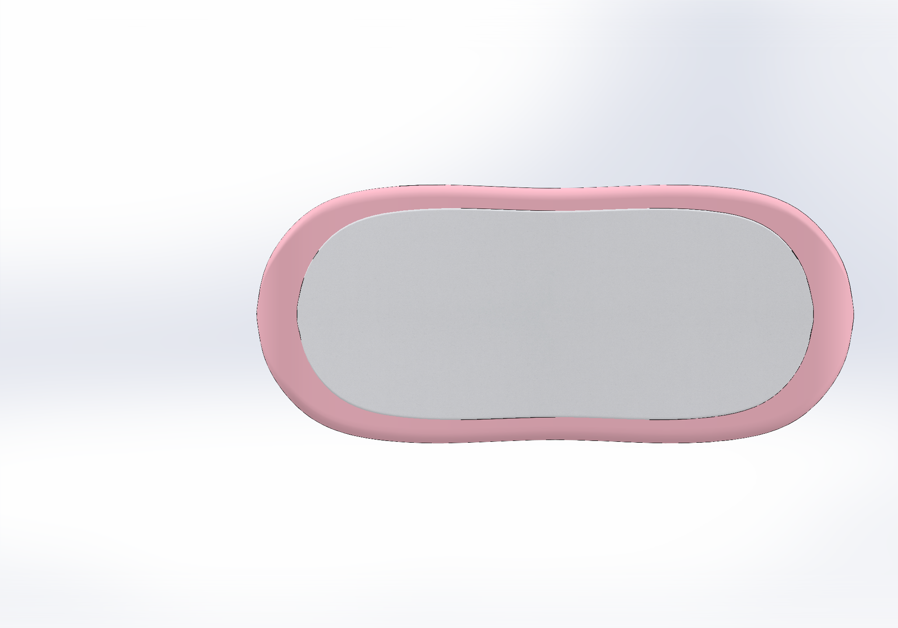

# HerComfort

  

HerComfort is a wearable health companion designed for menstrual comfort, physiological monitoring, local therapy control, and connected health support.

The project combines wearable mechanical design, custom electronics, sensing, therapy control, BLE connectivity, and embedded intelligence into a compact belt-based system.

---

## Project Status

HerComfort is currently under active development.

### Completed
- Refined wearable industrial design
- Curved front therapy/control enclosure
- Adjustable elastic belt architecture
- Dry EMG contact placement
- SolidWorks native model
- STEP export
- Multiple verified product views
- Mechanical body checks completed successfully

### In Progress
- Custom HerComfort main PCB
- Bare ESP32-C6 integration
- Integrated Muscle BioAmp Candy analog front-end
- Heating pad control
- Dual vibration motor control
- IMU integration
- Temperature sensing
- Battery charging and power management
- BLE firmware
- Mobile application integration

---

## Product Views

  
  

  
  

---

## Design Details

  
  

  
  

---

## Mechanical Design

The current HerComfort model represents the refined external industrial design.

### Main Dimensions

| Feature | Nominal Design |
|---|---|
| Therapy module | 185 mm long × 78 mm high |
| Maximum curved width | Approximately 80.1 mm |
| Overall depth envelope | Approximately 21.4 mm |
| Rear abdominal curvature | Approximately 3.5 mm sag across 160 mm |
| Rear comfort pad | Approximately 2.4 mm modeled section |
| Strap width | 48 mm |
| Strap thickness | 3 mm |
| USB-C access opening | 10 × 3.8 mm |
| Dry EMG contacts | 3 × 18 mm circular pads |
| EMG spacing | 30 mm center-to-center |

The current enclosure model is primarily an exterior product-design concept. Internal electronics packaging, PCB mounting, battery space, and detailed internal mechanical clearances are being integrated alongside the electronics design.

---

## Dry EMG Contact Layout

HerComfort includes three dry EMG contact locations on the skin-facing side of the inner belt.

- Three circular metallic contact pads
- 18 mm diameter each
- Positioned in one row
- 30 mm center-to-center spacing
- Located immediately beside the right-side connector area
- Embedded into the inner elastic belt surface

The electrodes are intended to connect to the integrated EMG analog front-end on the main HerComfort PCB.

---

## Electronics Architecture

The final HerComfort system is intended to use one compact custom main PCB inside the front enclosure.

The PCB will contain or control:

- Bare ESP32-C6
- Integrated Muscle BioAmp Candy analog front-end
- 6-axis IMU
- Therapy-zone temperature sensing
- Heating pad driver
- Two independent vibration motor drivers
- Physical control buttons
- RGB/status indication
- USB-C charging and programming
- Battery protection
- Battery monitoring
- BLE communication
- Safety and fault-control circuitry

The ESP32-C6 acts as the central controller for the complete wearable system.

---

## EMG Front-End

The EMG section is based on the Muscle BioAmp Candy architecture and is being integrated directly onto the HerComfort main PCB.

The signal chain is:

**Dry EMG electrodes → input network → amplification → band-pass filtering → ADC conditioning → ESP32-C6 ADC**

The original Candy topology uses:

- Quad op-amp architecture
- Nominal gain around ×2420
- Band-pass range approximately 72–720 Hz
- Buffered reference voltage
- Differential EMG acquisition

The final integrated version is being adapted carefully for direct use with the ESP32-C6 ADC.

---

## Therapy System

HerComfort is designed to provide two forms of local therapy:

### Heating Therapy
A flexible heating pad is intended to provide controlled warmth to the lower-abdominal region.

The heating subsystem will include:

- Closed-loop temperature control
- PWM-based heater power control
- Temperature feedback
- Over-temperature protection
- Hardware safety cutoff
- Fail-safe OFF behavior

### Vibration Therapy
Two independently controlled vibration motors are planned for the therapy region.

Supported control modes may include:

- Continuous vibration
- Pulse vibration
- Variable intensity
- Patterned/harmonic vibration

---

## Physical Controls

The product is planned around three dedicated physical control functions:

1. Power
2. Offline Therapy
3. SOS / Emergency

The enclosure will be updated so the physical control geometry aligns directly with the PCB switches.

---

## Connectivity

HerComfort uses BLE communication for interaction with the mobile application.

Planned functions include:

- Therapy control
- Sensor monitoring
- Battery status
- Session information
- Device status
- Offline operation
- Emergency/SOS support

Essential local functions are designed to remain available without continuous internet connectivity.

---

## Power System

The power architecture is under active design.

The final battery selection will be based on:

- Heating-pad current
- Dual vibration-motor current
- ESP32-C6 peak consumption
- EMG analog front-end consumption
- IMU
- Temperature sensor
- BLE activity
- Power-conversion losses
- Required runtime

Battery capacity will be finalized only after the complete load budget is locked.

---

## Repository Structure

### `Mechanical/`
Contains the mechanical design files including:

- SolidWorks model
- STEP export
- Mechanical design assets
- Product geometry

### `Images/`
Contains:

- Front view
- Rear view
- Top view
- Bottom view
- Left view
- Right view
- Isometric view
- Inner belt view
- EMG contact close-up
- Button and USB-C close-up
- Front module close-up
- Rear comfort pad close-up
- Combined product view

### `Electronics/`
Will contain:

- KiCad project
- Schematic
- PCB layout
- BOM
- Gerber files
- Pick-and-place files
- PCB renders

### `Documentation/`
Will contain:

- System architecture
- Design specifications
- Electrical documentation
- Testing notes
- Development records

---

## Tools Used

### Mechanical
- SolidWorks 2024

### Electronics
- KiCad

### Embedded System
- ESP32-C6
- Embedded C/C++

### Communication
- Bluetooth Low Energy

---

## Development Notes

HerComfort is being developed as an integrated wearable system rather than a collection of separate development modules.

The design approach focuses on:

- Compact custom electronics
- Wearable comfort
- Reliable sensing
- Controlled therapy
- Low-noise EMG acquisition
- Safe power management
- BLE connectivity
- Manufacturable PCB design
- Enclosure-integrated electronics

---

## Current Development Roadmap

1. Finalize electronic components
2. Complete HerComfort schematic
3. Complete PCB placement and routing
4. Match PCB to enclosure geometry
5. Finalize battery and power architecture
6. Assemble prototype PCB
7. Validate sensing and therapy
8. Test BLE and offline control
9. Perform thermal and electrical safety testing
10. Refine for manufacturing

---

## Disclaimer

HerComfort is currently a prototype-stage engineering project.

The present mechanical model represents the product design concept and enclosure geometry. Electronic, thermal, sensing, and safety functions are still under development and validation.

The project does not claim medical certification or clinical diagnostic capability at its current stage.

---

## Team

Developed as part of the HerComfort wearable health project for innovation and prototype development.
