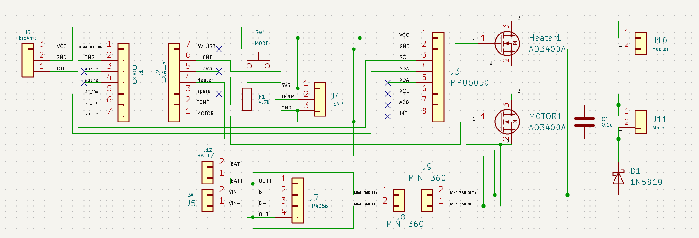
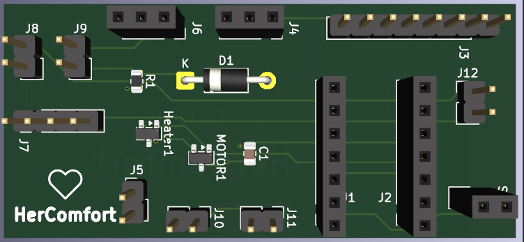
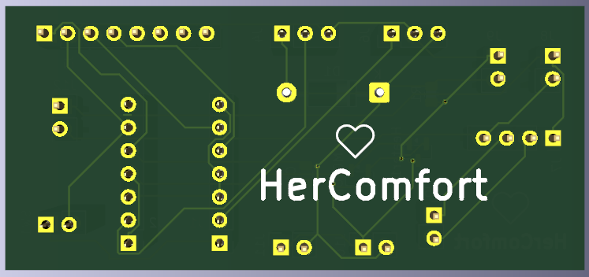
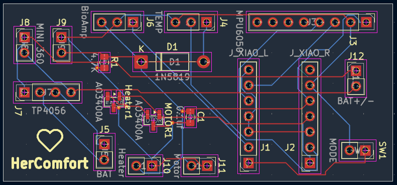
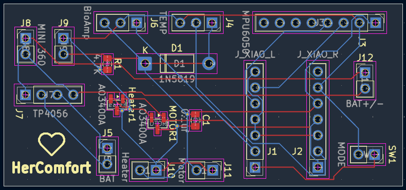

<p align="center">
  
</p>

# HerComfort

HerComfort is a wearable menstrual comfort and wellness solution designed to support women during emergencies, disasters, displacement, travel, relief-camp conditions, and other situations where access to conventional menstrual-care resources may be limited. During floods, earthquakes, evacuation, temporary shelters, or other emergency situations, women may have limited access to hot water, private resting spaces, continuous healthcare support, or convenient methods for managing menstrual discomfort. HerComfort aims to provide a portable, rechargeable, hands-free solution that combines controlled heating, vibration-based comfort, physiological monitoring, and local therapy control in a compact wearable belt.

The system integrates temperature monitoring, muscle-activity sensing, motion and posture awareness, BLE connectivity, and offline operation so that essential comfort functions can remain available even when continuous smartphone or internet access is not practical.
By combining wearable therapy, sensing, portability, and connected monitoring, HerComfort is intended to improve menstrual comfort, independence, and dignity for women in both everyday life and challenging emergency or disaster-response environments.

---

<p align="center">
  
  
</p>

<p align="center">
  <b>HerComfort Physical Prototype with Live Mobile Monitoring</b>
</p>

---

## Project Overview

HerComfort is being developed as an integrated wearable platform intended to support:

- Controlled heating therapy
- Vibration therapy
- EMG-based muscle activity monitoring
- Motion and posture sensing
- Temperature monitoring
- BLE connectivity
- Offline therapy control
- SOS / emergency support
- Battery-powered wearable operation

The final system is being designed around a compact custom PCB housed inside the curved front enclosure.

---

## Mechanical CAD Design

The refined HerComfort mechanical design was created in SolidWorks with a curved front therapy module, adjustable elastic belt, integrated controls, charging access, rear comfort surface, and dry EMG contact placement.

### Main Mechanical Dimensions

| Feature | Nominal Design |
|---|---|
| Therapy module | 185 mm long × 78 mm high |
| Maximum loft width | Approximately 80.1 mm |
| Overall depth envelope | Approximately 21.4 mm |
| Rear abdominal curvature | Approximately 3.5 mm sag across 160 mm |
| Rear comfort pad | Approximately 2.4 mm modeled section |
| Elastic strap | 48 mm wide × 3 mm thick |
| Charging opening | 10 × 3.8 mm USB-C access recess |
| Dry EMG contacts | Three 18 mm circular pads |
| EMG spacing | 30 mm center-to-center |
| Wearable circumference shown | Approximately 830 mm |

---

## Main CAD Views

### Front and Rear

<p align="center">
  
  
</p>

### Isometric and Inner View

<p align="center">
  
  
</p>

---

## EMG Contact Design

HerComfort includes three dry EMG contact points on the skin-facing inner side of the belt.

The contacts are designed as:

- 18 mm circular metallic pads
- Arranged in one row
- 30 mm center-to-center spacing
- Positioned near the front-right inner belt region
- Integrated into the wearable surface

The intended signal chain is:

**Dry EMG electrodes → Muscle BioAmp Candy → Signal conditioning → ESP32-C6 ADC**

---

## Electronics Development

HerComfort currently uses a custom KiCad-designed carrier PCB that integrates the existing prototype modules into a compact and serviceable wearable electronics platform.

The present carrier board interfaces:

- Seeed Studio XIAO ESP32C6
- MPU6050 IMU
- Muscle BioAmp Candy
- DS18B20 temperature sensor
- TP4056 charging module
- Mini-360 DC-DC converter
- Heating pad
- Vibration motor
- AO3400A MOSFET switching stages
- Physical Mode button
- Li-ion battery

This carrier board represents the current functional prototype electronics.

A future fully integrated HerComfort PCB is planned to replace the removable modules with dedicated onboard circuitry and additional safety, sensing, power-management, and protection features.

---

## PCB Carrier Board

A custom HerComfort carrier PCB has been designed in KiCad to replace loose prototype wiring and provide a cleaner, compact hardware platform for the current working electronics.

The carrier board supports:

- Seeed Studio XIAO ESP32C6
- MPU6050 IMU
- Muscle BioAmp Candy
- DS18B20 temperature sensor
- TP4056 Li-ion charging module
- Mini-360 DC-DC converter
- AO3400A MOSFET heater control
- AO3400A MOSFET vibration motor control
- 1N5819 flyback protection diode
- Mode push button
- Heating pad connection
- Vibration motor connection
- Li-ion battery connection

The removable modules are mounted using female headers so that the controller and sensor modules can be replaced or serviced without replacing the complete PCB.
Images/PCB_Images/PCB_Back.png
### PCB Schematic

<p align="center">
  
</p>

### PCB Front and Back Views

<p align="center">
  
  
</p>

### PCB Routing

<p align="center">
  
  
</p>

### Main GPIO Mapping

| Function | XIAO Pin | ESP32-C6 GPIO |
|---|---:|---:|
| Mode Button | D0 | GPIO0 |
| EMG Signal | D1 | GPIO1 |
| I²C SDA | D4 | GPIO22 |
| I²C SCL | D5 | GPIO23 |
| Vibration Motor | D7 | GPIO17 |
| DS18B20 Temperature | D8 | GPIO19 |
| Heating Pad | D10 | GPIO18 |

### Power Architecture

```text
3.7 V Li-ion Battery
        │
        ▼
      TP4056
        │
        ├────────► XIAO ESP32C6 battery input
        │
        ▼
     Mini-360
        │
        ▼
 Regulated therapy rail
        │
        ├────────► Heating Pad
        │
        └────────► Vibration Motor
