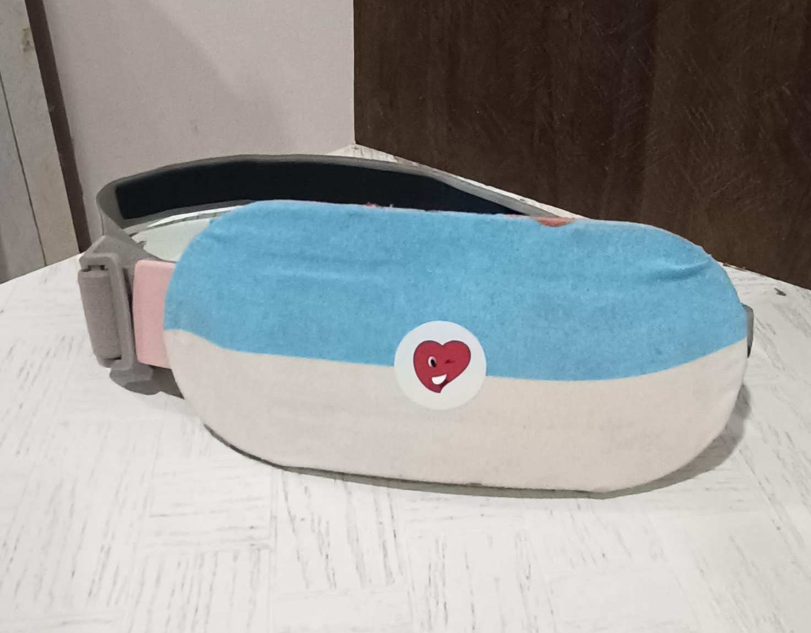
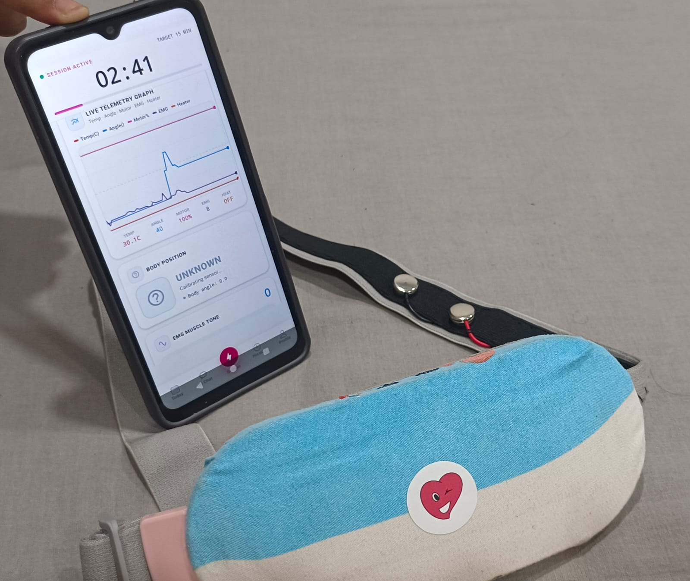
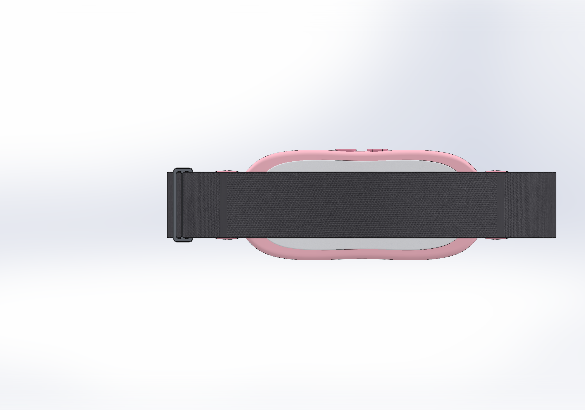
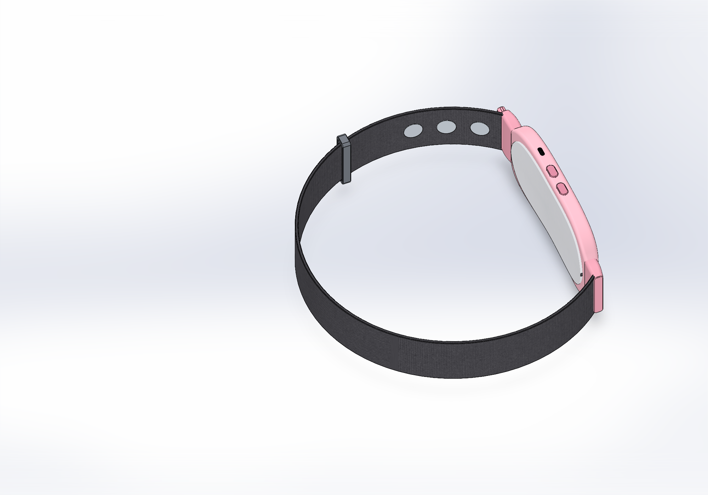

# HerComfort

  
  

  <b>HerComfort Physical Prototype with Live Mobile Monitoring</b>

HerComfort is a wearable health companion designed for menstrual comfort, physiological monitoring, local therapy control, and connected health monitoring and support.

The project combines wearable mechanical design, sensing, therapy control, BLE connectivity, mobile monitoring, and custom embedded electronics in a compact belt-based system.

---

## Project Overview

HerComfort is being developed as an integrated wearable platform intended to support:

- Controlled heating therapy
- Vibration therapy
- EMG-based muscle activity monitoring
- Motion and posture sensing
- Temperature monitoring
- BLE connectivity
- Offline therapy control
- SOS / emergency support
- Battery-powered wearable operation

The final system is being designed around a compact custom PCB housed inside the curved front enclosure.

---

## Mechanical CAD Design

The refined HerComfort mechanical design was created in SolidWorks with a curved front therapy module, adjustable elastic belt, integrated controls, charging access, rear comfort surface, and dry EMG contact placement.

### Main Mechanical Dimensions

| Feature | Nominal Design |
|---|---|
| Therapy module | 185 mm long × 78 mm high |
| Maximum loft width | Approximately 80.1 mm |
| Overall depth envelope | Approximately 21.4 mm |
| Rear abdominal curvature | Approximately 3.5 mm sag across 160 mm |
| Rear comfort pad | Approximately 2.4 mm modeled section |
| Elastic strap | 48 mm wide × 3 mm thick |
| Charging opening | 10 × 3.8 mm USB-C access recess |
| Dry EMG contacts | Three 18 mm circular pads |
| EMG spacing | 30 mm center-to-center |
| Wearable circumference shown | Approximately 830 mm |

---

## Main CAD Views

### Front and Rear

  
  

### Isometric and Inner View

  
  

---

## EMG Contact Design

HerComfort includes three dry EMG contact points on the skin-facing inner side of the belt.

The contacts are designed as:

- 18 mm circular metallic pads
- Arranged in one row
- 30 mm center-to-center spacing
- Positioned near the front-right inner belt region
- Integrated into the wearable surface

The intended signal chain is:

**Dry EMG electrodes → Integrated BioAmp Candy analog front-end → Signal conditioning → ESP32-C6 ADC**

---

## Electronics Development

The custom HerComfort electronics are currently under development.

The planned main PCB will contain or control:

- Bare ESP32-C6
- Integrated Muscle BioAmp Candy analog front-end
- 6-axis IMU
- Temperature sensing
- Heating pad control
- Two vibration motor channels
- Physical control buttons
- RGB/status indication
- USB-C charging and programming
- Battery monitoring
- BLE communication
- Safety and fault-control circuitry

The PCB is being designed to fit inside the curved pink front enclosure.

---

## Therapy Functions

### Heating Therapy

The heating subsystem is intended to provide:

- Controlled abdominal heating
- Temperature feedback
- PWM-based heater control
- Over-temperature protection
- Hardware safety cutoff
- Fail-safe OFF behavior

### Vibration Therapy

The system is planned with two independently controlled vibration motors supporting:

- Continuous vibration
- Pulse vibration
- Adjustable intensity
- Pattern-based therapy modes

---

## Mechanical Files

The `Mechanical/` directory contains:

- `HerComfort_Refined.SLDPRT`
- `HerComfort_Refined.step`
- `Design Notes.md`
- `Appearances/`
- `Views/`

The SolidWorks file contains the editable mechanical design, while the STEP file provides neutral geometry for integration and sharing.

---

## Current Development Status

### Completed
- Physical prototype
- Refined industrial design
- SolidWorks CAD model
- STEP export
- Dry EMG contact placement
- Mechanical views
- External enclosure concept

### In Progress
- Custom main PCB
- ESP32-C6 integration
- BioAmp Candy circuit integration
- Heating control electronics
- Vibration control electronics
- Power architecture
- Sensor integration
- BLE firmware
- Final enclosure-PCB integration

---

## Tools Used

- SolidWorks 2024
- KiCad
- ESP32-C6
- Embedded C/C++
- Bluetooth Low Energy

---

## Disclaimer

HerComfort is currently a prototype-stage engineering project.

The present mechanical design represents the product concept and enclosure geometry. Electronic, thermal, sensing, and safety functions are still under development and validation.

No medical certification or clinical diagnostic capability is currently claimed.
